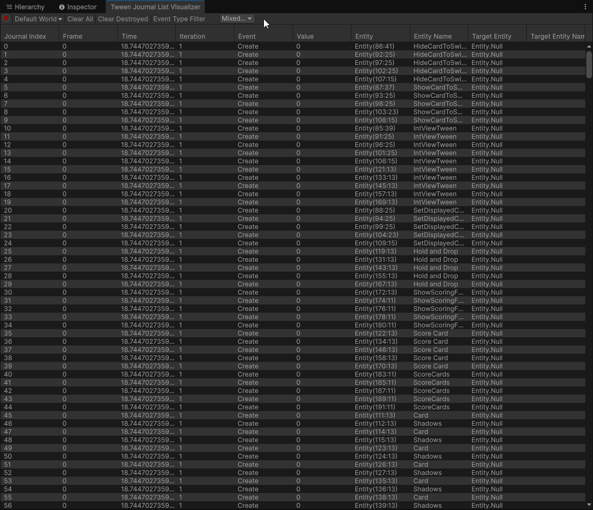
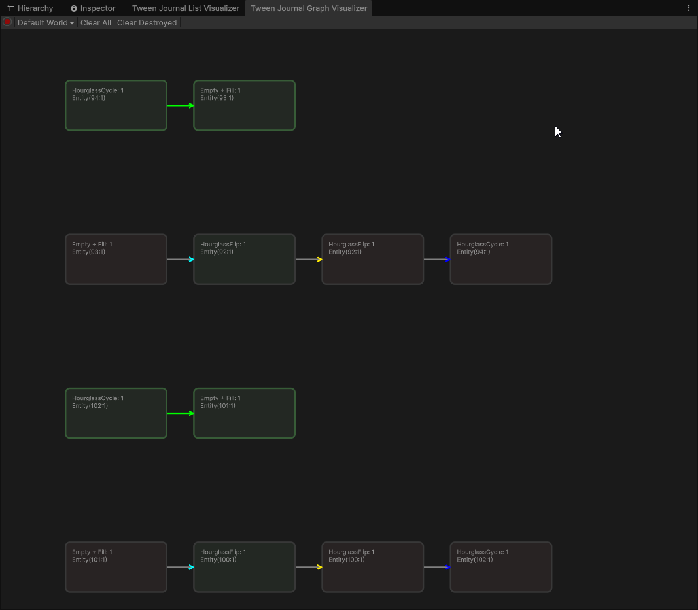

# Debugging

By adding the `HYPER_TWEEN_ENABLE_JOURNAL` scripting define symbol to your project, you can enable journaling of tweens
which can assist in debugging. Additionally, you must register tweens for journaling in one of the following ways:

* Call `.WithJournaling()` on a `TweenHandle`
* Create a tween with the `withJournaling` parameter set to true i.e. `HyperTweenFactory.CreateTween(withJournaling: true)`
* Create a factory with the `withJournaling` parameter set to true i.e. `HyperTweenFactory.Get(withJournaling: true)`
* Set the `HYPER_TWEEN_ENABLE_JOURNAL_BY_DEFAULT` scripting define symbol to enable journaling for all tweens

## Tween Journal List Visualizer

Open this debugger window using the `Window/HyperTween/Tween Journal List Visualizer` menu item.

This visualizer allows you to see all the various events that happen in relation to tweens, including timer and parameter updates.

## Tween Journal Graph Visualizer

Open this debugger window using the `Window/HyperTween/Tween Journal Graph Visualizer` menu item.

This visualizer allows you to debug tween sequences.

