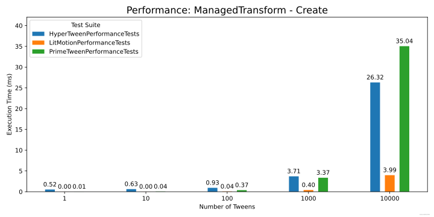
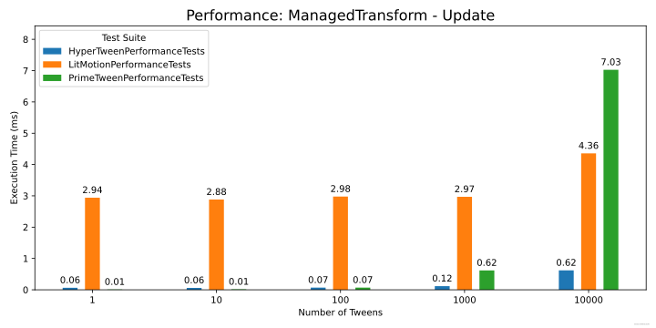
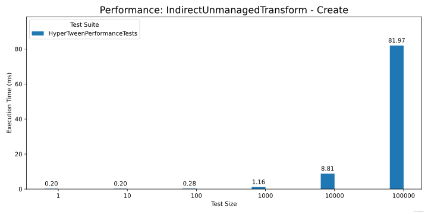
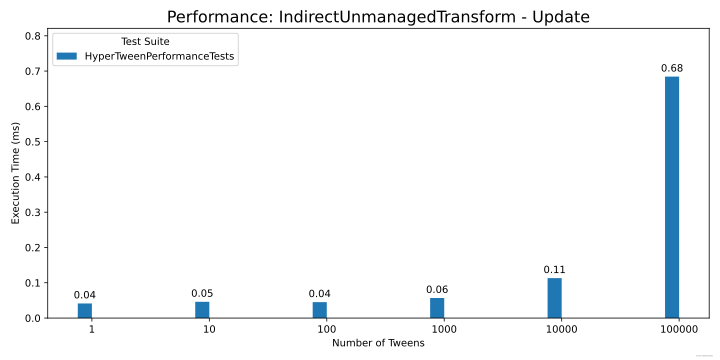
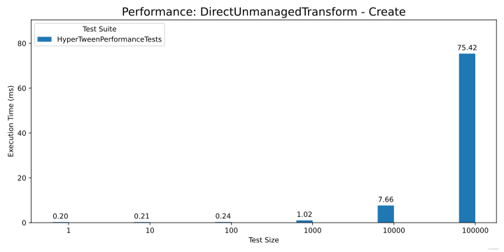
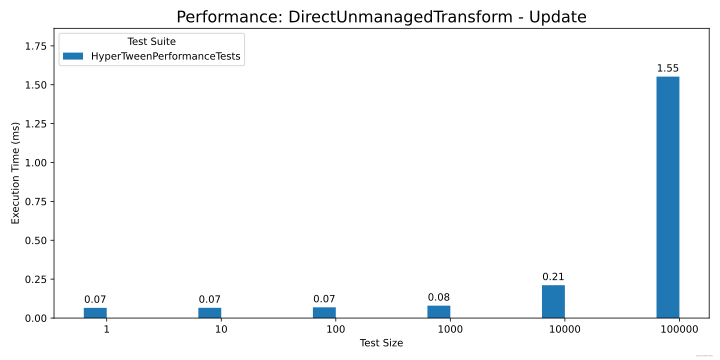

# Performance

HyperTween has been benchmarked against [PrimeTween](https://github.com/KyryloKuzyk/PrimeTween) and [LitMotion](https://github.com/annulusgames/LitMotion).

These benchmarks were built and run using the IL2CPP scripting backend optimized for runtime speed, and Master C++ compiler configuration.

The broad trend is that LitMotion is still the fastest at _creating_ tweens, with HyperTween coming in second in front of PrimeTween. While HyperTween allows creation of tweens in parallel jobs, it's worth noting that the majority of time spent in creating tweens is actually occupied by the playback of Entity Command Buffers, which at present happens in serial on the main thread.

In terms of actually updating the positions of managed transforms, HyperTween is significantly faster than either LitMotion or PrimeTween. That said, LitMotion exhibits a strange trend in that even tweening a single transform takes 3ms, so I suspect there is a bug in the current version.

When used purely with ECS entities, HyperTween was able to tween 100,000 LocalTransforms in less than a millisecond.

> [!NOTE]
> In the graphs below Direct vs Indirect refers to tweens that output to a LocalTransform on the same entity as the tween, vs tweens that output to a different entity. Surprisingly, Direct tweens do not update faster than Indirect tweens even though the memory access pattern is more linear. In future this type of tween may be deprecated as it requires an additional system and there doesn't seem to be much benefit.

